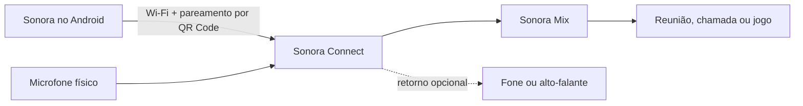

<p align="center">
  
</p>

<h1 align="center">Sonora</h1>

<p align="center">
  Um deck de sons para Android que injeta áudios, junto com a sua voz, em reuniões, chamadas e jogos no macOS.
</p>

<p align="center">
  <a href="https://github.com/alexbr-alves/sonora/releases/latest"></a>
  
  
  
</p>

## Baixar

| Plataforma | Instalador | Requisitos |
|---|---|---|
| Android | [Baixar Sonora.apk](https://github.com/alexbr-alves/sonora/releases/latest/download/Sonora.apk) | Android 8 ou superior |
| macOS | [Baixar Sonora-Connect.dmg](https://github.com/alexbr-alves/sonora/releases/latest/download/Sonora-Connect.dmg) | Mac com Apple Silicon |
| Entrada virtual macOS | [Baixar Sonora-Mix.pkg](https://github.com/alexbr-alves/sonora/releases/latest/download/Sonora-Mix.pkg) | Necessário para enviar voz + pads à chamada |

> **Preview:** os instaladores ainda não usam certificados públicos de distribuição. O Android pode pedir autorização para instalar apps desconhecidos. No macOS, clique com o botão direito em **Sonora Connect** e escolha **Abrir** na primeira execução.

## O que é o Sonora?

O **Sonora** transforma um Android em um deck de sons inspirado em controladores físicos. Cada pad pode reproduzir um áudio instantaneamente no próprio aparelho ou enviá-lo por Wi‑Fi ao **Sonora Connect**.

No Mac, o Sonora Connect mistura dois sinais:

- Sua voz, capturada pelo microfone físico.
- O áudio acionado no deck do Android.

O resultado aparece como **Sonora Mix**, uma entrada virtual selecionável no Meet, Zoom, Discord, Teams, jogos e outros aplicativos de chamada.



## Principais recursos

- Deck em tela cheia, adaptado automaticamente à orientação do aparelho.
- Grades configuráveis de `1×1` até `5×5`.
- Múltiplos layouts, ordenação por arraste lógico e troca por gesto lateral.
- Indicadores de página discretos na parte inferior.
- Biblioteca local com importação de arquivos de áudio.
- Pesquisa pública no MyInstants por texto, tendências e categorias.
- Reprodução online direta, sem download obrigatório.
- Um som por vez: o pad mais recente interrompe o anterior.
- Reprodução local quando o Android não está conectado ao computador.
- Pareamento automático por QR Code, com IP, porta e PIN.
- Tela mantida ativa enquanto o usuário está no Deck.
- Tolerância de 10 minutos ao bloqueio do Android, com reconexão automática.
- Mistura automática de voz e pads na entrada virtual **Sonora Mix**.
- Retorno opcional em fones ou alto-falantes para monitorar os pads.
- Atualização da lista de dispositivos de áudio sempre que ela é aberta.

## Como usar

1. Instale o **Sonora** no Android.
2. Instale e abra o **Sonora Connect** no Mac.
3. No Android, abra **Conexão** e toque em **Ler QR Code**.
4. Escaneie o QR Code exibido no Mac.
5. No aplicativo de reunião ou jogo, escolha **Sonora Mix** como microfone.
6. Volte ao Deck e toque em qualquer pad.

O retorno no Sonora Connect é opcional. Quando ativado, ele permite ouvir os pads sem devolver a sua própria voz ao fone.

## Instalação no Android

1. Baixe `Sonora.apk` no aparelho.
2. Abra o arquivo baixado.
3. Se solicitado, autorize o navegador ou gerenciador de arquivos a instalar apps desconhecidos.
4. Confirme a instalação.

A atualização usa o mesmo identificador técnico das builds anteriores para preservar biblioteca e layouts existentes.

## Instalação no macOS

1. Baixe e abra `Sonora-Connect.dmg`.
2. Arraste **Sonora Connect** para **Aplicativos**.
3. Baixe e abra `Sonora-Mix.pkg` para instalar a entrada virtual.
4. Na primeira execução, clique com o botão direito no app e selecione **Abrir**.
5. Autorize o acesso ao microfone quando solicitado.

### Entrada virtual Sonora Mix

O driver próprio está em [`native/macos/virtual-mic`](native/macos/virtual-mic). Usuários da versão publicada devem instalar `Sonora-Mix.pkg`. Para compilar e empacotar o driver a partir do código-fonte:

```bash
pnpm mac:driver:package
```

O instalador reinicia o serviço de áudio. Em seguida, selecione **Sonora Mix** como entrada no aplicativo de chamada.

## Privacidade e rede

- O pareamento acontece diretamente na rede local.
- Os pads são enviados do Android para o computador por WebSocket.
- O PIN tem seis dígitos e é gerado pelo Sonora Connect a cada execução.
- A biblioteca permanece armazenada localmente no Android.
- Não existe conta, telemetria própria ou servidor Sonora nesta versão.
- A pesquisa online consulta páginas públicas do MyInstants; o Sonora não é afiliado ao MyInstants.

## Estrutura do projeto

```text
apps/
├── mobile/              Android + Capacitor
├── macos/               runtime e assets do Sonora Connect
└── windows/             espaço reservado para a futura versão Windows
native/
└── macos/virtual-mic/    driver de áudio virtual Sonora Mix
src/
├── mobile/              Deck, layouts e biblioteca
└── desktop/             interface compacta do Sonora Connect
scripts/                 geração dos ícones do produto
```

O Electron é apenas a tecnologia interna de empacotamento do aplicativo para computador. Ele não faz parte do nome do produto.

## Desenvolvimento

### Requisitos

- Node.js 20 ou superior.
- pnpm.
- Android Studio/JDK para builds Android.
- Xcode Command Line Tools para builds macOS e do driver.

### Preparar o projeto

```bash
git clone https://github.com/alexbr-alves/sonora.git
cd sonora
pnpm install
```

### Executar o ambiente desktop

```bash
pnpm dev
```

### Validar código e testes

```bash
pnpm typecheck
pnpm test
pnpm build
```

### Gerar o APK Android

```bash
pnpm android:build
```

Resultado: `apps/mobile/android/app/build/outputs/apk/debug/app-debug.apk`.

### Gerar o aplicativo e o DMG do macOS

```bash
pnpm mac:app
pnpm mac:dmg
```

Resultados em `release/macos/`.

## Estado do projeto

O Sonora está em desenvolvimento ativo. A versão atual é adequada para testes, uso pessoal e validação do fluxo completo Android → Mac → microfone virtual.

### Próximos passos

- Assinatura e notarização dos instaladores macOS.
- Keystore Android de produção e distribuição pela Play Store.
- Instalação guiada do Sonora Mix.
- Aplicativo Sonora Connect para Windows.
- Editor avançado de aparência dos pads.
- Atalhos, pastas e ações adicionais por layout.

## Autor

Desenvolvido por **[alexbr-alves](https://github.com/alexbr-alves)**.

Contato: [alexbr.alves@gmail.com](mailto:alexbr.alves@gmail.com)

---

<p align="center">Sonora no Android. Sonora Connect no computador. Sua voz e seus sons, juntos.</p>
